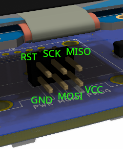

# robotont-firmware-power-management

Firmware for the power management chip (ATtiny88) on the Robotont mainboard v0.3.0. It handles the
power button, switches system and motor power, drives the status LEDs and buzzer, reads the battery
pack and reports everything to the main controller over I2C.

## You need

- An **ISP programmer** — a USBasp or USBtinyISP, or an Arduino turned into one (see below)
- USB cable + 6 jumper wires
- [VS Code](https://code.visualstudio.com/) with the **PlatformIO IDE** extension
- This repository, opened as a folder in VS Code

> [!TIP]
> The chip is powered via the programmer — the robot needs no battery.

<details>
<summary><b>No programmer? Turn an Arduino Nano or Uno into one</b></summary>

Plug the Nano into USB. Open the **[arduino-isp/](arduino-isp/)** folder in VS Code and press
**→ (Upload)** in the status bar.

Using an Uno? Pick the `uno` env in the status bar first. Sync timeout on a Nano? Try `nano_old` for
the old bootloader.

</details>

<details>
<summary><b>Using a USBasp or USBtinyISP?</b></summary>

Set `upload_protocol = usbasp` in [platformio.ini](platformio.ini).

</details>

## 1. Wire it to the robot

*PROG header, 2x3 angled pins, under the OLED display. The programmer stays in USB.*

<table>
<tr>
<td valign="top">

| Nano / Uno | PROG |
|------------|------|
| 3.3V | VCC |
| GND  | GND |
| D13  | SCK |
| D12  | MISO |
| D11  | MOSI |
| D10  | RESET |

</td>
<td valign="top">

</td>
</tr>
</table>

## 2. Flash the ATtiny88

*Open **this** folder in VS Code and press **→ (Upload)**.*

*Done — the chip restarts into the new firmware.*

## If it fails

- **Wrong port** — expected `/dev/ttyUSB0`; change `upload_port` in [platformio.ini](platformio.ini)
  (e.g. `/dev/ttyACM0`, `COM3`).
- **Permission denied (Linux)** — `sudo usermod -aG dialout $USER`, then log in again.
- **Device signature error** — check the six wires and that the programmer works.

---

## For developers

### Build

Configured in [platformio.ini](platformio.ini): ATtiny88, Arduino framework, 1 MHz internal clock,
upload via `stk500v1` at 19200 baud. Fuses (lfuse `0x62`, hfuse `0xDF`, efuse `0xFF`) are written with
`pio run --target fuses` — only needed on a blank chip.

### Layout

```
include/Config.h   pin map, timings, I2C address — start here
src/main.cpp       setup and main loop
lib/OneWire/       vendored OneWire fork, used for the battery
arduino-isp/       separate project: ArduinoISP sketch for the Nano/Uno
```

| Module | What it does |
|--------|--------------|
| [SensorManager](src/SensorManager.cpp) | Samples 4 analog inputs in the ADC interrupt; tracks stop button and wall power via pin-change interrupts |
| [PowerController](src/PowerController.cpp) | Power button logic, system/motor power switching, LED and sound feedback |
| [MakitaBattery](src/MakitaBattery.cpp) | Reads the battery pack over 1-Wire (`CC D7 00 00 FF`) |
| [I2CCommunication](src/I2CCommunication.cpp) | Sends the data packet to the main controller, recovers a stuck bus |
| [UserInterface](src/UserInterface.cpp) | LEDs and buzzer |

The main loop is non-blocking: I2C every 200 ms, status LED toggle every 500 ms, battery read every 5 s.

### Behaviour

Hold the power button ~0.6 s to turn on, ~1.2 s to turn off (`POWER_ON_HOLD_TIME`,
`POWER_OFF_HOLD_TIME`). Motors get power only when the system is on, the stop button is released and
the robot runs on battery; connecting wall power cuts motor power immediately, inside the interrupt.

| Stop button LED | Meaning |
|-----------------|---------|
| Off | System off |
| Green | Motors enabled |
| Yellow | Wall power, motors disabled |
| Red | Stop button pressed, motors disabled |

### I2C protocol

The ATtiny88 is the **master** and writes 25 bytes to address `0x12` (the main controller) every
200 ms, retrying up to 3 times with a bus recovery in between.

| Byte | Field | | Byte | Field |
|------|-------|-|------|-------|
| 0 | Status bits (below) | | 9-10 | Pack voltage |
| 1-2 | Motor current (raw ADC) | | 11-20 | Cell voltages ×5 |
| 3-4 | NUC current (raw ADC) | | 21-22 | Cell temperature |
| 5-6 | System voltage (raw ADC) | | 23-24 | MOSFET temperature |
| 7-8 | Battery voltage (raw ADC) | | | |

All 2-byte values are unsigned, high byte first. Sensor fields are raw 10-bit ADC counts; scaling
happens on the main controller. Battery fields come from the pack itself.

Status bits: 0 stop button, 1 power button (only read at boot, not kept up to date), 2 wall power,
3 motor power, 4 system power, 5-7 unused.

### Known quirks

- **Don't use Arduino `bitWrite`/`bitSet`/`bitClear` on registers** — they work on 32-bit values and
  misbehave on the 8-bit registers. Use `PORTA |= (1 << PIN)` / `PORTA &= ~(1 << PIN)`.
- **Some comments assume 8 or 16 MHz**, but the CPU runs at 1 MHz: I2C actually runs at ~12.5 kHz, and
  the ADC free-runs from its own interrupt rather than at the 400 Hz the Timer1 comment claims.
- **The watchdog is not enabled** — `wdt_reset()` is called, `wdt_enable()` never is.
- **Sounds block the main loop.** `playBeep()` busy-waits, so the power-on and wall-power sounds stall
  I2C reporting for 0.4-0.5 s.

## License

Apache 2.0 — see [LICENSE](LICENSE).
